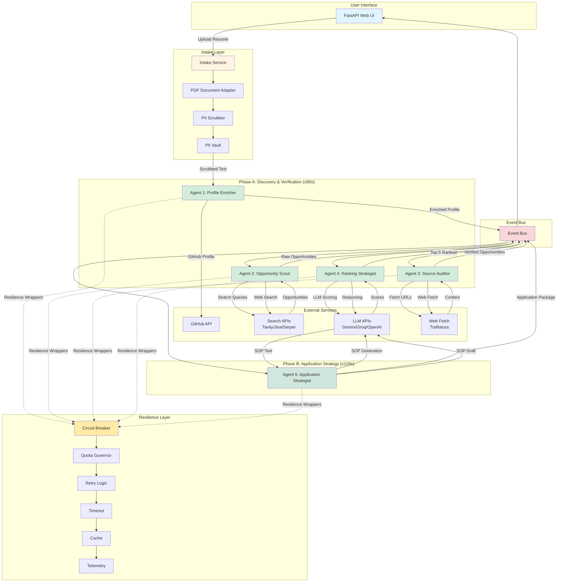
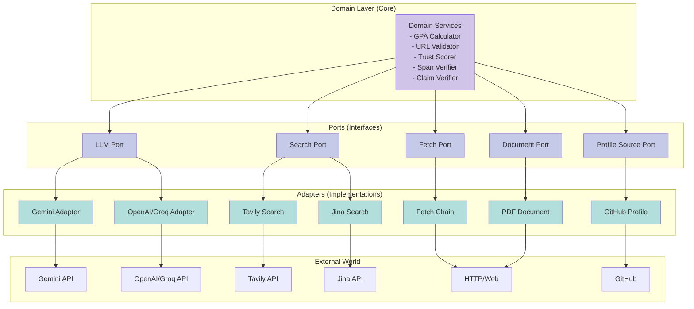

# Architecture Diagram

## System Overview

```mermaid
graph TB
    subgraph "User Interface"
        UI[FastAPI Web UI]
    end

    subgraph "Intake Layer"
        INTAKE[Intake Service]
        PDF[PDF Document Adapter]
        PII[PII Scrubber]
        VAULT[PII Vault]
    end

    subgraph "Phase A: Discovery & Verification (≤90s)"
        AGENT1[Agent 1: Profile Enricher]
        AGENT2[Agent 2: Opportunity Scout]
        AGENT3[Agent 3: Source Auditor]
        AGENT4[Agent 4: Ranking Strategist]
    end

    subgraph "Phase B: Application Strategy (≤120s)"
        AGENT5[Agent 5: Application Strategist]
    end

    subgraph "Resilience Layer"
        CB[Circuit Breaker]
        QG[Quota Governor]
        RT[Retry Logic]
        TM[Timeout]
        CACHE[Cache]
        TEL[Telemetry]
    end

    subgraph "External Services"
        GITHUB[GitHub API]
        SEARCH[Search APIs<br/>Tavily/Jina/Serper]
        LLM[LLM APIs<br/>Gemini/Groq/OpenAI]
        WEB[Web Fetch<br/>Trafilatura]
    end

    subgraph "Event Bus"
        BUS[Event Bus]
    end

    UI -->|Upload Resume| INTAKE
    INTAKE --> PDF
    PDF --> PII
    PII --> VAULT
    VAULT -->|Scrubbed Text| AGENT1

    AGENT1 -->|Enriched Profile| BUS
    BUS --> AGENT2

    AGENT2 -->|Search Queries| SEARCH
    SEARCH -->|Opportunities| AGENT2
    AGENT2 -->|Raw Opportunities| BUS
    BUS --> AGENT3

    AGENT3 -->|Fetch URLs| WEB
    WEB -->|Content| AGENT3
    AGENT3 -->|Verified Opportunities| BUS
    BUS --> AGENT4

    AGENT4 -->|LLM Scoring| LLM
    LLM -->|Scores| AGENT4
    AGENT4 -->|Top-5 Ranked| BUS
    BUS --> AGENT5

    AGENT5 -->|SOP Generation| LLM
    LLM -->|SOP Text| AGENT5
    AGENT5 -->|Application Package| BUS
    BUS --> UI

    AGENT1 -.->|Resilience Wrappers| CB
    AGENT2 -.->|Resilience Wrappers| CB
    AGENT3 -.->|Resilience Wrappers| CB
    AGENT4 -.->|Resilience Wrappers| CB
    AGENT5 -.->|Resilience Wrappers| CB

    CB --> QG
    QG --> RT
    RT --> TM
    TM --> CACHE
    CACHE --> TEL

    AGENT1 -->|GitHub Profile| GITHUB
    AGENT2 -->|Web Search| SEARCH
    AGENT3 -->|Web Fetch| WEB
    AGENT4 -->|Reasoning| LLM
    AGENT5 -->|SOP Draft| LLM

    style UI fill:#e1f5ff
    style INTAKE fill:#fff4e1
    style AGENT1 fill:#d4edda
    style AGENT2 fill:#d4edda
    style AGENT3 fill:#d4edda
    style AGENT4 fill:#d4edda
    style AGENT5 fill:#d1e7dd
    style BUS fill:#f8d7da
    style CB fill:#ffeaa7
```

## Hexagonal Architecture (Ports & Adapters)

```mermaid
graph TB
    subgraph "Domain Layer (Core)"
        DOMAIN[Domain Services<br/>- GPA Calculator<br/>- URL Validator<br/>- Trust Scorer<br/>- Span Verifier<br/>- Claim Verifier]
    end

    subgraph "Ports (Interfaces)"
        PORT_LLM[LLM Port]
        PORT_SEARCH[Search Port]
        PORT_FETCH[Fetch Port]
        PORT_DOC[Document Port]
        PORT_PROFILE[Profile Source Port]
    end

    subgraph "Adapters (Implementations)"
        ADAPT_GEMINI[Gemini Adapter]
        ADAPT_OPENAI[OpenAI/Groq Adapter]
        ADAPT_TAVILY[Tavily Search]
        ADAPT_JINA[Jina Search]
        ADAPT_FETCH[Fetch Chain]
        ADAPT_PDF[PDF Document]
        ADAPT_GITHUB[GitHub Profile]
    end

    subgraph "External World"
        EXT_GEMINI[Gemini API]
        EXT_OPENAI[OpenAI/Groq API]
        EXT_TAVILY[Tavily API]
        EXT_JINA[Jina API]
        EXT_WEB[HTTP/Web]
        EXT_GITHUB_DB[GitHub]
    end

    DOMAIN --> PORT_LLM
    DOMAIN --> PORT_SEARCH
    DOMAIN --> PORT_FETCH
    DOMAIN --> PORT_DOC
    DOMAIN --> PORT_PROFILE

    PORT_LLM --> ADAPT_GEMINI
    PORT_LLM --> ADAPT_OPENAI
    PORT_SEARCH --> ADAPT_TAVILY
    PORT_SEARCH --> ADAPT_JINA
    PORT_FETCH --> ADAPT_FETCH
    PORT_DOC --> ADAPT_PDF
    PORT_PROFILE --> ADAPT_GITHUB

    ADAPT_GEMINI --> EXT_GEMINI
    ADAPT_OPENAI --> EXT_OPENAI
    ADAPT_TAVILY --> EXT_TAVILY
    ADAPT_JINA --> EXT_JINA
    ADAPT_FETCH --> EXT_WEB
    ADAPT_PDF --> EXT_WEB
    ADAPT_GITHUB --> EXT_GITHUB_DB

    style DOMAIN fill:#d1c4e9
    style PORT_LLM fill:#c5cae9
    style PORT_SEARCH fill:#c5cae9
    style PORT_FETCH fill:#c5cae9
    style PORT_DOC fill:#c5cae9
    style PORT_PROFILE fill:#c5cae9
    style ADAPT_GEMINI fill:#b2dfdb
    style ADAPT_OPENAI fill:#b2dfdb
    style ADAPT_TAVILY fill:#b2dfdb
    style ADAPT_JINA fill:#b2dfdb
    style ADAPT_FETCH fill:#b2dfdb
    style ADAPT_PDF fill:#b2dfdb
    style ADAPT_GITHUB fill:#b2dfdb
```
