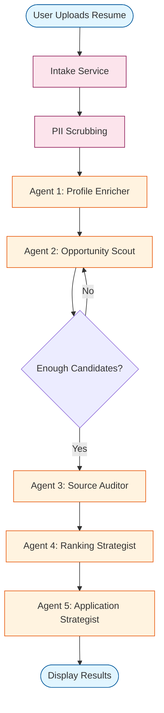
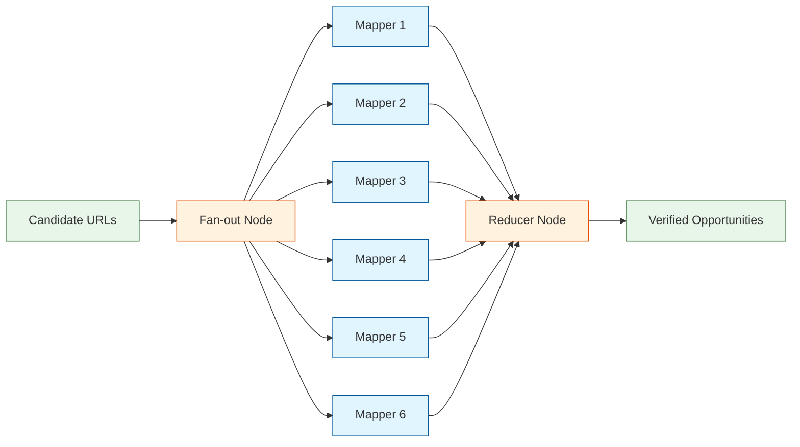
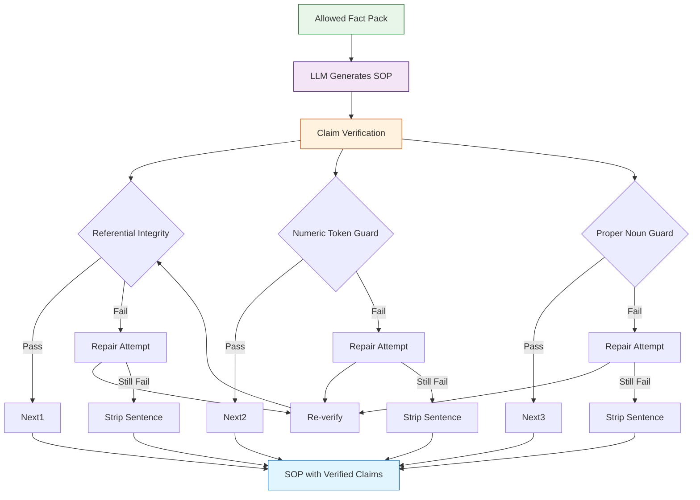

# Simple Agent Workflow Diagram

## High-Level Flow

```mermaid
flowchart TD
    Start([User Uploads Resume]) --> Intake[Intake Service]
    Intake --> Scrub[PII Scrubbing]
    Scrub --> Agent1[Agent 1: Profile Enricher]
    Agent1 --> Agent2[Agent 2: Opportunity Scout]
    Agent2 --> Retry{Enough Candidates?}
    Retry -->|No| Agent2
    Retry -->|Yes| Agent3[Agent 3: Source Auditor]
    Agent3 --> Agent4[Agent 4: Ranking Strategist]
    Agent4 --> Agent5[Agent 5: Application Strategist]
    Agent5 --> End([Display Results])

    style Start fill:#e1f5ff,stroke:#01579b
    style End fill:#e1f5ff,stroke:#01579b
    style Intake fill:#fce4ec,stroke:#880e4f
    style Scrub fill:#fce4ec,stroke:#880e4f
    style Agent1 fill:#fff3e0,stroke:#e65100
    style Agent2 fill:#fff3e0,stroke:#e65100
    style Agent3 fill:#fff3e0,stroke:#e65100
    style Agent4 fill:#fff3e0,stroke:#e65100
    style Agent5 fill:#fff3e0,stroke:#e65100
```

## Parallel Processing in Source Auditor

```mermaid
flowchart LR
    Candidates[Candidate URLs] --> FanOut[Fan-out Node]
    FanOut --> M1[Mapper 1]
    FanOut --> M2[Mapper 2]
    FanOut --> M3[Mapper 3]
    FanOut --> M4[Mapper 4]
    FanOut --> M5[Mapper 5]
    FanOut --> M6[Mapper 6]
    M1 --> Reducer[Reducer Node]
    M2 --> Reducer
    M3 --> Reducer
    M4 --> Reducer
    M5 --> Reducer
    M6 --> Reducer
    Reducer --> Verified[Verified Opportunities]

    style Candidates fill:#e8f5e9,stroke:#1b5e20
    style FanOut fill:#fff3e0,stroke:#e65100
    style M1 fill:#e1f5ff,stroke:#01579b
    style M2 fill:#e1f5ff,stroke:#01579b
    style M3 fill:#e1f5ff,stroke:#01579b
    style M4 fill:#e1f5ff,stroke:#01579b
    style M5 fill:#e1f5ff,stroke:#01579b
    style M6 fill:#e1f5ff,stroke:#01579b
    style Reducer fill:#fff3e0,stroke:#e65100
    style Verified fill:#e8f5e9,stroke:#1b5e20
```

## Anti-Hallucination Flow

```mermaid
flowchart TD
    Facts[Allowed Fact Pack] --> LLM[LLM Generates SOP]
    LLM --> Verify[Claim Verification]
    Verify --> Guard1{Referential Integrity}
    Verify --> Guard2{Numeric Token Guard}
    Verify --> Guard3{Proper Noun Guard}
    Guard1 -->|Pass| Next1
    Guard1 -->|Fail| Repair1[Repair Attempt]
    Guard2 -->|Pass| Next2
    Guard2 -->|Fail| Repair2[Repair Attempt]
    Guard3 -->|Pass| Next3
    Guard3 -->|Fail| Repair3[Repair Attempt]
    Repair1 --> Reverify[Re-verify]
    Repair2 --> Reverify
    Repair3 --> Reverify
    Reverify --> Guard1
    Next1 --> Final[SOP with Verified Claims]
    Next2 --> Final
    Next3 --> Final
    Repair1 -->|Still Fail| Strip1[Strip Sentence]
    Repair2 -->|Still Fail| Strip2[Strip Sentence]
    Repair3 -->|Still Fail| Strip3[Strip Sentence]
    Strip1 --> Final
    Strip2 --> Final
    Strip3 --> Final

    style Facts fill:#e8f5e9,stroke:#1b5e20
    style LLM fill:#f3e5f5,stroke:#4a148c
    style Verify fill:#fff3e0,stroke:#e65100
    style Final fill:#e1f5ff,stroke:#01579b
```

## Resilience Stack

```mermaid
flowchart LR
    Request[API Call] --> Telemetry[1. Telemetry]
    Telemetry --> Cache[2. Cache Check]
    Cache -->|Hit| Response[Return Cached]
    Cache -->|Miss| Quota[3. Quota Governor]
    Quota -->|Allowed| Breaker[4. Circuit Breaker]
    Breaker -->|Closed| Retry[5. Retry Layer]
    Breaker -->|Open| Error[Fast Fail]
    Retry --> Timeout[6. Timeout Layer]
    Timeout --> API[Execute API Call]
    API --> Success[Success]
    Success --> CacheWrite[Cache Write]
    CacheWrite --> Response
    Retry -->|Exhausted| Error
    Timeout -->|Timeout| Error

    style Request fill:#e1f5ff,stroke:#01579b
    style Response fill:#e8f5e9,stroke:#1b5e20
    style Error fill:#ffebee,stroke:#c62828
    style Telemetry fill:#fff3e0,stroke:#e65100
    style Cache fill:#fff3e0,stroke:#e65100
    style Quota fill:#fff3e0,stroke:#e65100
    style Breaker fill:#fff3e0,stroke:#e65100
    style Retry fill:#fff3e0,stroke:#e65100
    style Timeout fill:#fff3e0,stroke:#e65100
    style API fill:#f3e5f5,stroke:#4a148c
    style Success fill:#e8f5e9,stroke:#1b5e20
    style CacheWrite fill:#fff3e0,stroke:#e65100
```

## Phase Timeline

```mermaid
gantt
    title Agent Execution Timeline
    dateFormat s
    axisFormat %Ss

    section Phase A (Discovery)
    Profile Enricher       :a1, 0, 15s
    Opportunity Scout      :a2, 15, 20s
    Source Auditor         :a3, 35, 25s
    Ranking Strategist     :a4, 60, 15s

    section Phase B (Application)
    Application Strategist :b1, 75, 30s
```
